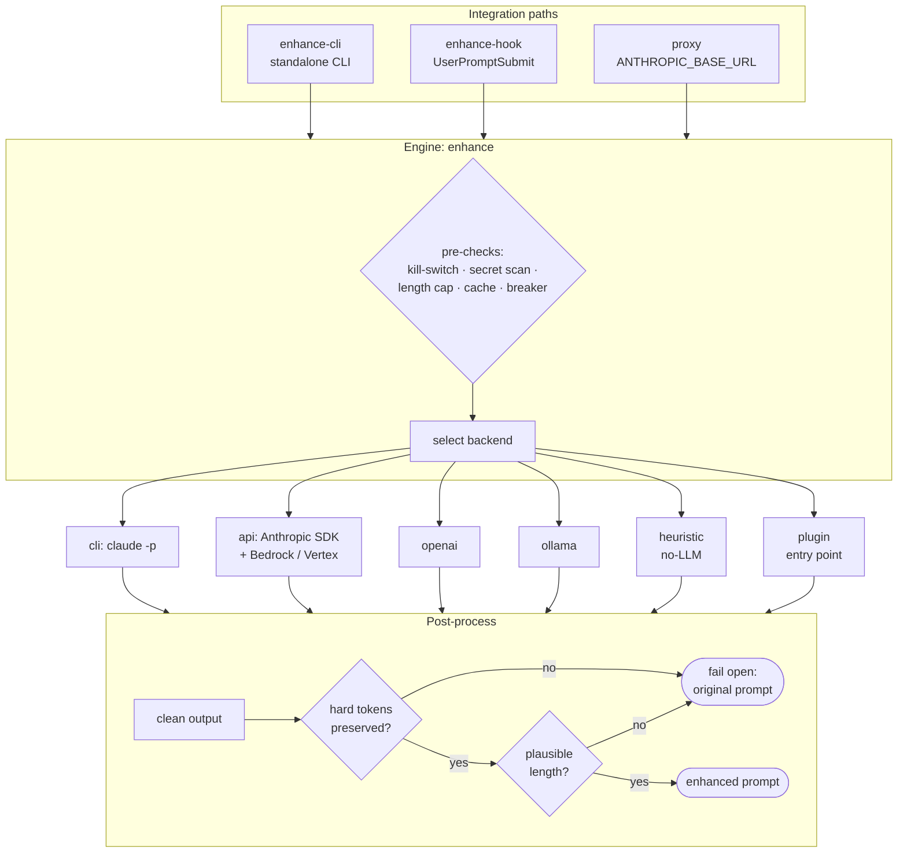

# Architecture

## How a prompt flows

Three integration paths feed one engine. The engine selects a backend, runs the rewrite,
then puts the result through a safety pipeline that can always fall back to the original.

## Design principles

1. **Faithful or nothing.** The rewrite is accepted only if it survives a programmatic
   faithfulness check and a length-ratio guard. Otherwise the original is used.
2. **Fail-open everywhere.** No path can block or corrupt a prompt; the worst case is a
   short delay.
3. **Private by default.** No prompt content touches disk unless explicitly opted in;
   credentials are detected and never forwarded to the enhancer.
4. **Conservative replacement.** The proxy rewrites only a genuine main user turn and
   streams everything else through untouched.

## The three paths, compared

| | Proxy | Hook | CLI |
|---|---|---|---|
| Replacement | true (request body) | additive (`additionalContext`) | true (its own output) |
| Setup | `enhance` launcher | one settings.json entry | none |
| Best for | interactive Claude Code | zero-setup fallback | desktop / web apps |
| `//raw` bypass | strips token | left as-is (can't strip) | strips token |

## vs. other prompt-enhancer tools

| | prompt-preflight | Browser "improve prompt" buttons | Static prompt templates |
|---|---|---|---|
| Where it runs | local (proxy/hook/CLI) | vendor server | n/a |
| Faithfulness guard | yes (token + length check, fail-open) | none | n/a |
| Privacy | nothing on disk by default; secrets stripped | sent to a third party | local |
| Offline option | yes (`ollama`, `heuristic`) | no | yes |
| Works inside Claude Code | yes (true replacement) | no | manual |
| Cost model | ~1¢ Haiku pre-pass, cached system prompt | bundled/opaque | free |

## Repository layout

| Module | Responsibility |
|--------|----------------|
| `engine.py` | backend dispatch, safety pipeline, fail-open, caching, circuit breaker |
| `safety.py` | secret/PII detection, important-token & length guards, output cleanup |
| `proxy.py` | local replacing proxy, transparent relay, stats/metrics, tracing |
| `hook.py` | `UserPromptSubmit` hook (additive context) |
| `cli.py` | standalone CLI, REPL, clipboard watch, config/doctor/init/stats |
| `launcher.py` | `enhance` — rewrite first prompt, start proxy, launch claude |
| `policy.py` | classify a prompt: enhance / passthrough / raw |
| `config.py` | dataclass config, JSON file, `PROMPT_ENHANCER_*` overrides, validation |
| `system_prompt.py` | the enhancer system prompt + per-profile variants |
