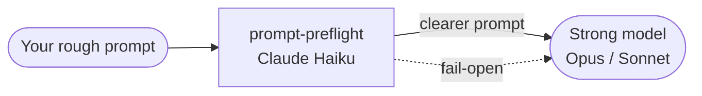

# prompt-preflight

**Rewrite rough, vague prompts into clearer, better-structured ones with Claude Haiku
before they reach a stronger model** — through a Claude Code proxy, a `UserPromptSubmit`
hook, or a standalone CLI.

You type the way you always do. A small, fast model does a *pre-flight* pass that
sharpens scope and structure **without inventing requirements**, and only the improved
prompt is sent onward. If anything goes wrong, it **fails open** to your original text —
the tool can slow you down by at most a second, never block you.

## Why

A stronger model rewards a clearer prompt. But stopping to hand-craft every prompt is
friction. prompt-preflight removes that friction: it spends ~1 second and a fraction of a
cent on Haiku so your expensive model spends its budget on a well-framed request.

## Three ways to use it

| Path | What it does | Best for |
|------|--------------|----------|
| **Proxy** (`enhance`) | True replacement — Claude Code is routed through a local proxy that rewrites the request body | Interactive Claude Code |
| **Hook** (`enhance-hook`) | Injects a clarified restatement as `additionalContext` | Zero-setup fallback |
| **CLI** (`enhance-cli`) | Rewrites text and copies it to your clipboard | Desktop / web apps |

## Core guarantees

- **Faithful.** A programmatic check verifies your hard tokens (paths, URLs, code spans,
  numbers) survive the rewrite; if any are dropped, it fails open.
- **Private.** Nothing is written to disk by default. Diagnostics are opt-in and
  local-only. Credentials are detected and never sent to the enhancer.
- **Safe.** Fail-open everywhere, a kill-switch (`PROMPT_ENHANCER_DISABLE=1`), and a
  `//raw` bypass to skip enhancement on demand.

Start with the [Quickstart](quickstart.md).
